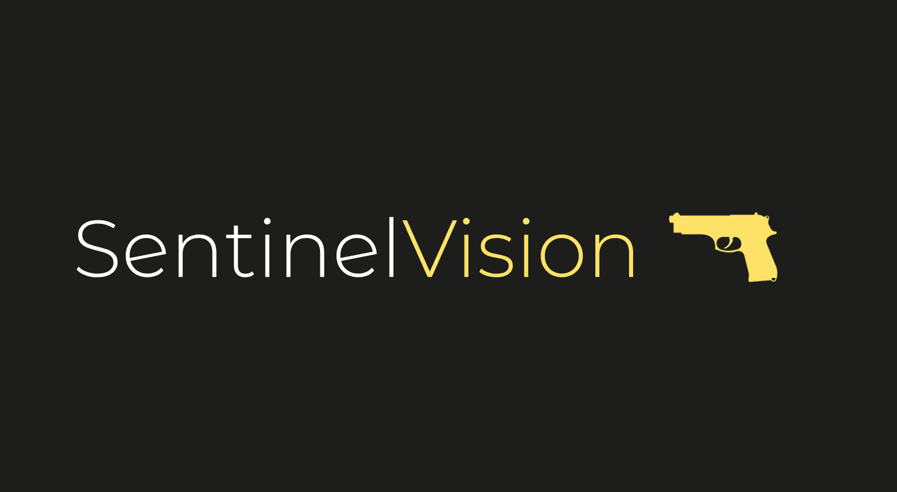

# SentinelVision



SentinelVision is an AI-powered gun detection system designed to enhance security and safety measures, particularly for small businesses vulnerable to armed robberies. The system analyzes video feeds in real-time, detects firearms, and triggers immediate alerts to authorities, enabling swift response and potentially preventing crimes before they escalate.

## Table of Contents

- [Features](#features)
- [Installation](#installation)
- [Usage](#usage)
- [Contributing](#contributing)
- [License](#license)

## Features

- **Real-Time Gun Detection:** Utilizes the YOLOv10 model trained on a dataset of 9,256 annotated images for accurate firearm detection in video streams.
- **Enhanced Video Processing:** Applies Contrast Limited Adaptive Histogram Equalization (CLAHE) and gamma correction for optimal image quality before analysis.
- **Automatic Alert System:** Triggers instant alerts to law enforcement upon detecting firearms, along with capturing and forwarding frames for suspect identification.
- **User-Friendly Interface:** Streamlit-based application for easy video upload and real-time monitoring of detection results.

## Installation

To install SentinelVision, follow these steps:

1. Clone the repository:

   ```bash
   git clone https://github.com/your-username/SentinelVision.git
   cd SentinelVision

2. Install dependencies:
     ```bash
    pip install -r requirements.txt

3. Download the YOLOv10 model weights (train9_best.pt) and place them in the root directory of the project.

## Usage
To run SentinelVision:
    ```bash
    streamlit run app.py